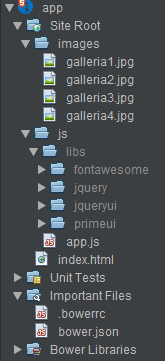

# Galleria Demos

Small, focused demos to be used when illustrating, and discussing 'lessons learned',
on how to integrate various
kinds of external components into Oracle JET applications, building up
from simple non-JET scenarios to more complex fully developed JET scenarios.

In <b>Galleria1-Default</b>, a simple straightforward plain and simple JavaScript app
shows usage of the PrimeUI 'puigalleria' component:

In <b>[Galleria2-Knockout https://github.com/GeertjanWielenga/GalleriaDemos/tree/master/Galleria1-Default/app ]</b>, a modular app (RequireJS) together with Knockout is used
to integrate the JQuery UI Accordion component via a Knockout component:

