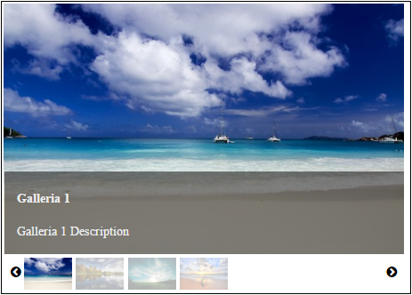
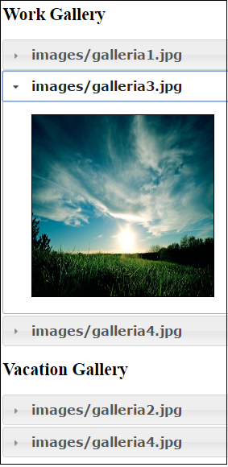

# Galleria Demos

In Galleria1-Default, a simple straightforward plain and simple JavaScript app
shows usage of the PrimeUI 'puigalleria' component:

In Galleria2-Knockout, a modular app (RequireJS) together with Knockout is used
to integrate the JQuery UI Accordion component via a Knockout component:

